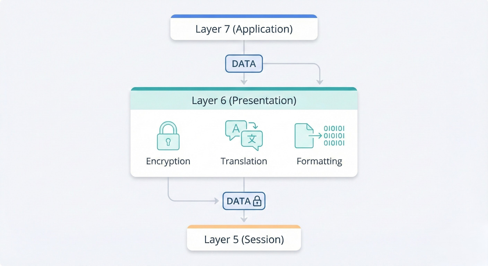
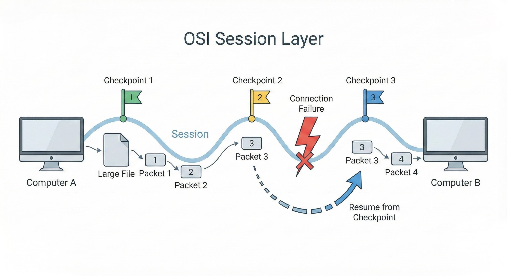

# The OSI Model

> This section breaks down the OSI model—a core concept that explains how different network devices can talk to each other.

---

## What is the OSI Model?

The **OSI (Open Systems Interconnection) model** is a rulebook for how computers communicate. Think of it as a universal language for network devices. It doesn't matter if you have a Mac, a Windows PC, or a smart fridge—as long as they follow the OSI rules, they can understand each other. This ensures a message sent from one device can be correctly interpreted by another, even if they are made by different companies.

### The Seven Layers

The OSI model is organized into seven layers, stacked on top of one another. We number these layers from top to bottom—starting with Layer 7 and going all the way down to Layer 1.

Each layer has its own specific job. When you send data, it travels down through these layers and gets wrapped in extra information at each step. This process is called **encapsulation**, and we'll explore it more later. When another device receives your data, it reverses the process, unwrapping the data as it travels back up the layers.

  
   
  <em>Figure 1: A diagram illustrating the seven layers of the OSI model.</em>

---

## 1. Layer 7 — Application

This is the layer you probably interact with the most, often without even realizing it! The **Application Layer** acts as the user's direct interface to the network. It's what connects you to all the amazing services and data available online.

These applications work at Layer 7 and provide the familiar graphical interfaces (GUIs) that you use daily. Some common examples, along with the protocols they often use, include:

*   **Web browsers** (**HTTP/HTTPS**) — for browsing websites
*   **Email clients** (**SMTP, IMAP, POP3**) — for sending and receiving emails
*   **File transfer apps** (**FTP, SFTP**) — for uploading/downloading files (like FileZilla)
*   Messaging apps, streaming services, and online games also operate at this layer, each with their own set of rules to communicate effectively.

This layer also defines important rules (**protocols**) that applications use to communicate. A great example is **DNS (Domain Name System)**. DNS is like the internet's phonebook—it translates easy-to-remember website names (like `google.com`) into the numerical **IP addresses** that computers actually use (e.g., `172.217.160.142`). Without DNS, you'd have to type long numbers to visit your favorite sites!

  
   
  <em>Figure 2: YouTube open in a browser, showing a Layer 7 interaction.</em>

---

## 2. Layer 6 — Presentation

The **Presentation Layer** (Layer 6) is where the magic of data standardization happens in the OSI model. Think of it as the universal translator and formatter for your data.

Imagine you're trying to read a document that's in a file format your computer doesn't understand—you'd need a special program to convert it, right? That's exactly what the Presentation Layer does for network communication! It makes sure that data sent from one application (like an email client) is transformed into a format that the receiving application can actually understand and display, even if they are completely different programs.

This layer sits between the **Application Layer** (Layer 7), where your apps live, and the rest of the network. Its main job is to ensure that different systems can "speak the same language" when it comes to how data looks. For example, it handles things like:

*   **Data Formatting:** Converting data into a standard format (like ASCII, JPEG, or MPEG) so that different devices can interpret it correctly.
*   **Data Compression:** Making data smaller for faster transmission across the network.
*   **Data Encryption/Decryption:** Adding a layer of security by encrypting data before it's sent and decrypting it upon arrival. This is where secure connections like **HTTPS** (for secure websites) operate, protecting your sensitive information.

So, whether you're sending an email, browsing a secure website, or opening a picture, the Presentation Layer is working behind the scenes to make sure the data is properly prepared for its journey and correctly understood at its destination.

  
   
  <em>Figure 3: How the Presentation Layer (Layer 6) translates, formats, and encrypts data.</em>

---

## 3. Layer 5 — Session

The **Session Layer** (Layer 5) is the network's conversation manager. Once your data has been properly formatted and encrypted by the Presentation Layer, this layer steps in to open up a direct line of communication with the computer on the other end.

Its main job is to create, manage, and tear down a **session**—which is just a dedicated, private conversation between two devices. Before any data starts flowing, the Session Layer makes sure both computers are ready and synchronized.

One of its most important jobs is to make data transfers more reliable. It does this by breaking large amounts of data into smaller chunks. But here's the cool part: it sets **checkpoints** as it sends these chunks.

Think of it like saving your progress in a video game. If your internet connection suddenly drops while you're downloading a huge file, you don't have to start the download all over again from 0%. Thanks to the Session Layer, the transfer can resume from the last successful checkpoint, saving you a ton of time and frustration. It's a simple but brilliant way to make sure data gets where it's going, even if the connection isn't perfect.

  
   
  <em>Figure 4: The Session Layer resuming a data transfer from a checkpoint after a connection failure.</em>

